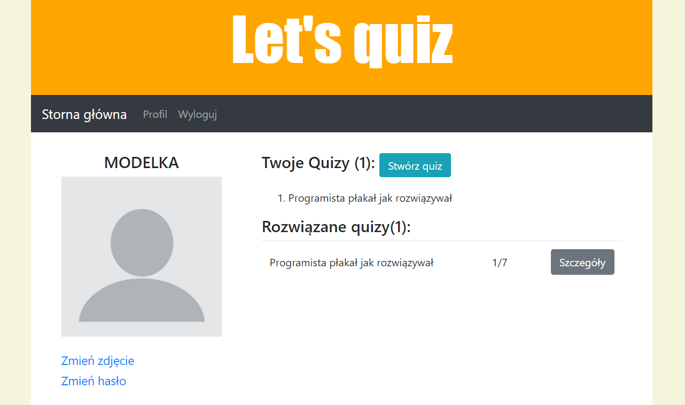

# Let's quiz 

* [About](#about)
* [Technologies](#technologies)
* [Running locally](#running-locally)
* [Inspiration](#inspiration)

## About
**Let's quiz** allows you to create your own quizzes and solve your 
friends' quizzes. Registration is required to get access to these features.
This project is an attempt to better and more fully understand 
Django's user management mechanisms and everything related to it.



## Technologies
Project is created with:
* Django == 3.1.6
* Python == 3.9.1
	
## Running locally
Follow the instructions step by step:

```bash
git clone https://github.com/PatrycjaModelska/Lets-quiz.git
pip install -r requirements.txt
python manage.py migrate
python manage.py runserver
```

The project will be available at **127.0.0.1:8000**.

## Inspiration
This app is inspired by Vitor Freitas from [@Simply is better than complex](https://simpleisbetterthancomplex.com/tutorial/2018/01/18/how-to-implement-multiple-user-types-with-django.html#practical-example) and Antonio Mele's book [@Django 3. Praktyczne tworzenie aplikacji sieciowych](https://helion.pl/ksiazki/django-3-praktyczne-tworzenie-aplikacji-sieciowych-wydanie-iii-antonio-mel,dj3pt3.htm#format/d).
